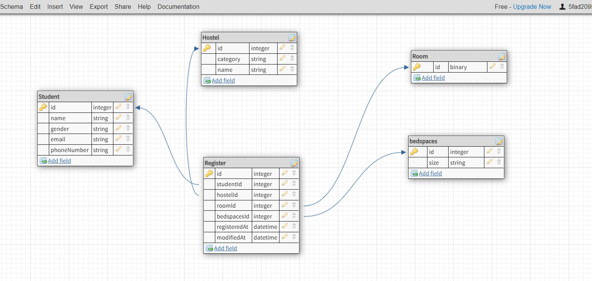
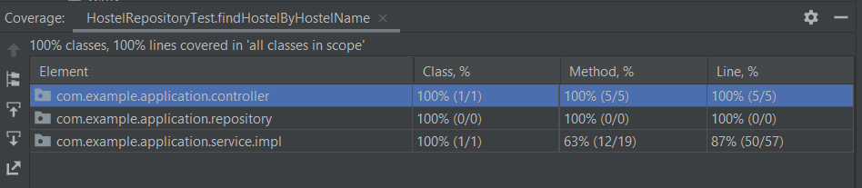

# Hostel-Management-System
Java project written and compiled using Java Spring Boot framework and intelliJ IDEA.
This project focuses on implementing unitTest (UT) and integrationTest (IT) using Junit and Mockito while building the Hostel Management System than designing the project's schema in an optimal way
## The Domain Classes:
Classes are `Hostel` `Room` `Student` `HostelName` `BedSpace` `Gender`
- The system comprises two male hostels and two female hostels
- Each Hostel consists of twenty Rooms.
- Each Room consists of four Bedspaces.

## The support actions:
- Students can register on the system.
- Students can request a bed space.
- You can find all students in a Hostel by providing the name of the Hostel.
- You can find all students in a room by providing the room id.

## Database schema
Database schema created in dbdesigner.net 

## Coverage % 
the coverage % of Both unit and integration tests 